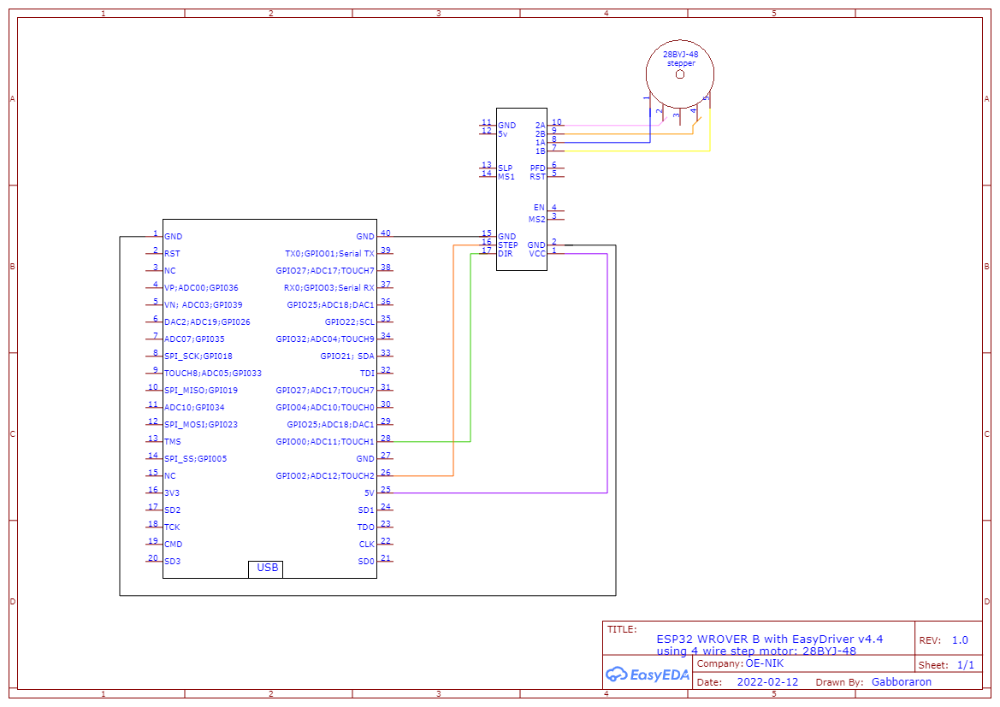

# 28BYJ-48 motor vezérlése ESP32-WROVER-B által
ötlet: [circuit.io](https://www.circuito.io/app?components=9238,9442,360217)

**Megvalósítás:**



[fájl EasyEDA](SCHLIB_ESP32-WROVER-B_2022-02-12.json)hoz

kód:

```C
#include "Arduino.h"
#include "StepperMotor.h"

const int STEP  = 2;
const int DIR   = 0;
const int DELAY = 1000;

StepperMotor stepper(STEP,DIR);

void setup() {
    
    Serial.begin(9600);
    while (!Serial) ; // wait for serial port to connect. Needed for native USB
    Serial.println("start");
    
    // enable the stepper motor, use .disable() to disable the motor
    stepper.enable();
    // set stepper motor speed by changing the delay value, the higher the delay the slower the motor will turn
    stepper.setStepDelay(DELAY);
}

void loop() {
    stepper.step(1, 1000);  // move motor 1000 steps in one direction
    delay(1000);            // short stop
    stepper.step(0, 1000);  // move motor 1000 steps in the other dirction
    delay(1000);            //short stop
}
```

fájl: [28byj48_step_motor.ino](28byj48_step_motor.ino)